<!-- { "layout": "title" } -->
# Efeitos Visuais
## Por que nem tudo são ~~flores~~triângulos...

---
<!-- { "layout": "regular" } -->
# Objetivos

1. Entender o funcionamento de **_skyboxes_** para maquear a limitação do
   campo de visão
1. Conhecer a técnica de **_billboarding_** e **_spriting_** para
   renderização "barata"
1. Simular o comportamento e aparência de gases e fogo com **sistemas
   de partículas**
1. Conhecer técnicas para geração de **sombras**
1. Conhecer técnica s para simulação de reflexão (espelho, metal etc.)
   usando **_environment mapping_**
1. Conhecer efeitos de câmera **_depth of field_** e **_motion blur_**

---
<!-- { "layout": "section-header", "slideClass": "skybox" }-->
# Skybox

- Contempla o horizonte inatingível
- Variações:
  1. Skybox
  1. Skysphere
  1. Skydome

---
<!-- {"layout": "regular"} -->
# Skybox

- 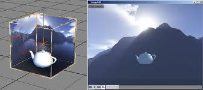 <!-- {.push-right} -->
   <!-- {.push-right style="clear:right; width: 300px;"} -->
  Para maquear a limitação do campo de visualização, podemos usar um
  _**skybox**_ envolvendo todo o frustum
- Um _skybox_ é tipicamente criando usando um **cubo** cujas faces internas
  recebem texturas que representam o que pode ser visto no **horizonte
  da cena**
  - Mas outros modelos podem ser usados além do cubo:
    - Esfera: _sky sphere_
    - Hemisfério: _sky dome_ <!-- {ul^0:.multi-column-list} -->
  - O _skybox_ **deve se mover** juntamente com a **câmera**, mas não rotacionar junto dela
- É possível implementar usando texturas do tipo `CUBEMAP`

---
<iframe src="http://stemkoski.github.io/Three.js/Skybox.html" width="100%" height="100%" frameborder="0"></iframe>

---
<!-- { "layout": "section-header", "slideClass": "billboarding", "slideHash": "sprites-e-billboarding" } -->
# _Sprites_ e _Billboarding_

- Sprites 2D em 3D
- Rastreamento da câmera

---
<!-- {"layout": "regular"} -->
# Sprites e Billboarding

::: figure .centered
 <!-- {.crispy-image style="height: 100px"} --> <!-- {p:style="display:flex; align-items: center"} --> ->
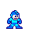 <!-- {.crispy-image style="height: 100px"} -->
:::

> **Sprite:** um retângulo, com uma posição, orientação e uma textura

  - Animações quadro a quadro podem ser feitas, utilizando mais imagens e
    alterando qual imagem está sendo mostrada
- Um caso especial de _sprite_ é a técnica de **billboarding**
  - Neste caso, a sprite é **orientada de acordo
    com a direção de visualização**
  - Quando a visualização muda, a orientação do polígono muda (eg, quadro da Monalisa)

---
<!-- {"layout": "regular"} -->
## Billboarding não é um conceito novo

- Apesar de ser um jogo 3D, todos os inimigos e objetos do jogo Doom eram _billboards_

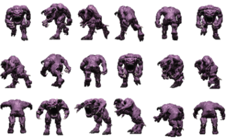 <!-- {style="height: 160px"} -->
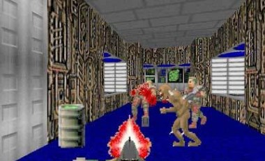 <!-- {style="height: 160px"} -->
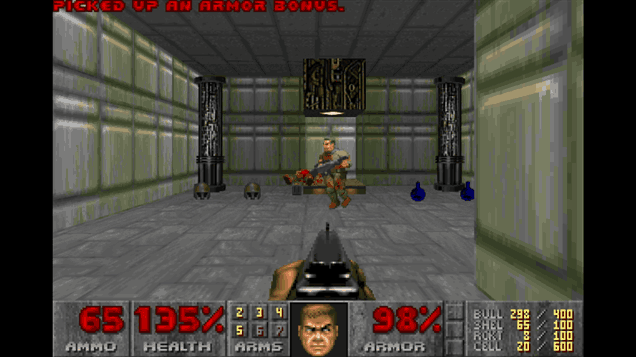 <!-- {style="height: 160px"} -->
<!-- {p:.centered} -->

Há pelo menos 3 tipos de _billboards_: _screen-aligned_, _world-oriented_ e axial <!-- {p:.note.info} -->

---
<iframe src="../../samples/billboards/index.html" width="100%" height="100%" frameborder="0"></iframe>

---
<!-- {"layout": "regular"} -->
# Tipos de Billboard

1. ::: figure .
   <video width="200" class="push-right" poster="../../images/screen-aligned-billboard.jpg" controls>
     <source src="../../videos/screen-aligned-billboard.mp4" type="video/mp4" />
   </video>
   :::
   _Screen-aligned_ <!-- {ol:.full-width.no-margin} -->
   - Imagem sempre paralela à tela
   - <span class="math">normal = -view</span>
   - <span class="math">up = camera.up</span>
   - Útil para textos explicativos, efeito de _lens flare_
1. 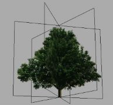 <!-- {.push-right style="width: 200px"} -->
   _World-oriented_
   - <span class="math">normal = -view</span>
   - **<span class="math">up = world.up</span>**
   - Usado para objetos simétricos (eg, partículas de fogo)
1. _Axial_
   - Rotaciona no próprio **eixo da base** com **variação limitada**
   - <span class="math">up = world.up</span>
   - Árvores distantes que tentam ficar de frente pra câmera

---
<!-- {"layout": "regular"} -->
# **Impostores**

> Um **impostor** é um billboard que substitui um objeto 3D da cena
- Exemplo: renderização de nuvens em tempo real ([_Harris and Lastra_, 2001](http://www.markmark.net/PDFs/RTClouds_HarrisEG2001.pdf), [vídeo](https://www.youtube.com/watch?v=kV9hGEwpOyU)):

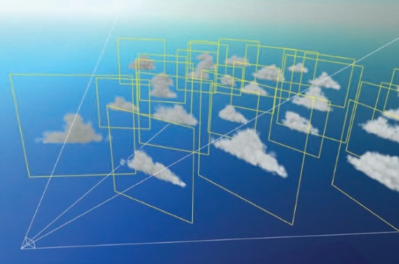 <!-- {.medium-height} --> <!-- {p:.center-aligned} -->
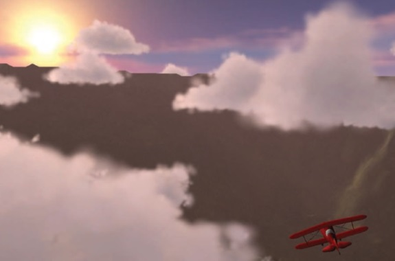 <!-- {.medium-height} --> <!-- {p:.no-margin} -->


---
<!-- { "layout": "section-header", "slideClass": "sombras-em-tempo-real", "slideHash": "sombras-em-tempo-real" } -->
# Sombras em Tempo Real

- O uso de sombras em uma cena aumenta o realismo e   fornece dicas visuais para a profundidade e
  posição de objetos
- Técnicas:
  1. Hack simplão
  1. Shadow volumes
  1. Shadow maps

---
<!-- {"layout": "regular"} -->
# Sombras (1): **_Hack_ simplão**

- 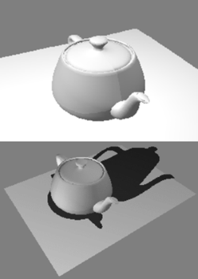 <!-- {.push-right} -->
  Renderizar cada objeto duas vezes:
  - Primeiro passo: renderizar normalmente
  - Segundo passo: projetar no plano do chão e renderizar totalmente preto
- Pros:
  - Fácil e até convincente
- Cons:
  - Torna-se rapidamente um problema geométrico complexo
    - Fácil projetar em um plano infinito
    - Mas e numa escada? Morro?

---
<!-- {"layout": "regular"} -->
## Sombras (2): **_Shadow Volumes_**

- A técnica foi proposta em 1977 (Frank Crow), mas popularizada com o jogo
  Doom 3
- 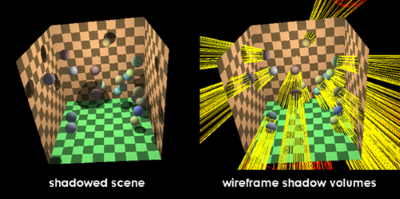 <!-- {.push-right} -->
  Para cada par <luz, objeto>, computar a região da malha que obstrui a luz
  1. Encontrar a silhueta sob a perspectiva da luz
  2. Projetar a silhueta ao longo dos raios da luz (fazer uma extrusão)
  3. Triangular (gerar triângulos) conectando a silhueta e sua projeção para
     obter o **volume da sombra**
- Um ponto <span class="math">P</span> está na sombra da luz
  <span class="math">L</span> se algum volume de sombra contém
  <span class="math">P</span>
- Tipicamente, usa-se o _stencil buffer_ ([Everitt e Kilgard, 2002](http://arxiv.org/ftp/cs/papers/0301/0301002.pdf))

---
<!-- {"layout": "regular"} -->
## Sombras (2): **_Shadow Volumes_** (1)

- 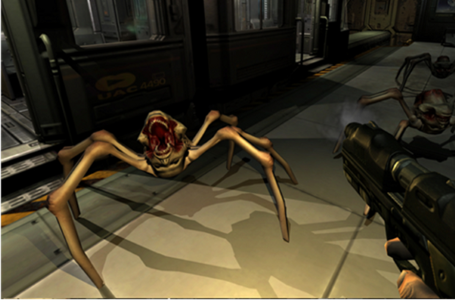 <!-- {.push-right} -->
  Pros:
  - A sombra é super precisa (a nível de pixel) e não sofre problemas de
    _aliasing_
- Cons:
  - Computacionalmente mais cara que _shadow maps_

---
<!-- {"layout": "regular"} -->
## Sombras (3): **_Shadow Maps_** (1)

- 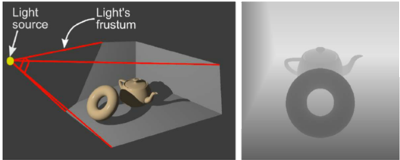 <!-- {.push-right} -->
  Renderiza a cena usando **cada fonte de luz como centro de projeção**,
  salvando apenas o _z-buffer_
  - Imagens 2D resultantes são os **mapas de sombras** (uma por fonte de luz)
- Em seguida, renderiza a cena do ponto de vista da câmera

---
<!-- {"layout": "regular"} -->
## Sombras (3): **_Shadow Maps_** (2)

- 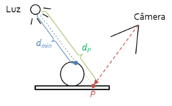 <!-- {.push-right} -->
  Para determinar se ponto <span class="math">P</span> de um objeto está
  na sombra:
  1. Computar a distância <span class="math">d_P</span> de
     <span class="math">P</span> até a fonte de luz
  1. Converter <span class="math">P</span> das coordenadas do mundo para
     coordenadas do _shadow map_ (usando matrizes
     <span class="math">projection * view</span> usada para gerar o mapa)
  1. Recuperar a distância <span class="math">d_{min}</span> no mapa
  1. <span class="math">P</span> está na sombra se
     <span class="math">d_P \leq d_{min}</span>, _i.e._, se estiver atrás de um
     objeto mais próximo da fonte


---

<iframe src="https://threejsfundamentals.org/threejs/threejs-shadows-point-light.html" width="100%" height="100%" frameborder="0"></iframe>

---
<!-- {"layout": "regular"} -->
## Sombras (3): **_Shadow Maps_** (3)

-  <!-- {.push-right style="width: 220px;"} --> <!-- {li:.bullet} -->
  Pros:
  - Pode ser extendida para ter _soft shadows_ ➡️
  - Mais barata que _shadow volumes_
- 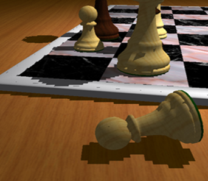 <!-- {.push-right style="width: 220px; clear: both;"} --> <!-- {li:.bullet} -->
  Cons:
  - Implementação simples tem problemas de _aliasing_ ↘️
    - Câmera mais próxima da sombra que a fonte, muitos pixels podem ser
      cobertos por apenas um "texel" do _shadow map_
- Há várias técnicas para resolver o problema de _aliasing_... <!-- {li:.bullet} -->

---
<!-- {"layout": "regular"} -->
## Sombras (3): **_Shadow Maps_** (4)

- **_Screen Space Blurred Shadow Mapping_**:
  - Sombras renderizadas em uma textura e ela é borrada e então aplicada na tela
- **_Percentage Closer Filtering_**:
  - Usa mais de um "texel" do _shadow map_ para determinar se ponto está na
    sombra

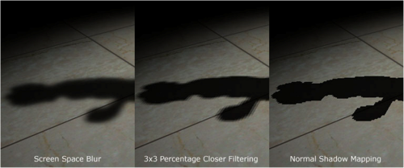 <!-- {p:.centered} -->

---
<!-- { "layout": "section-header", "slideClass": "sistema-de-particulas", "slideHash": "sistema-de-particulas" } -->
# Sistema de partículas

- Um **sistema de partículas** é um conjunto de objetos pequenos colocados
  em movimento, usando algum algoritmo
- Com ele, é possível simular: **fogo, fumaça, explosões, galáxias giratórias,
  lançamento de magias, efeito de "_level up_"** etc.

---

<iframe src="../../samples/particles/index.html" width="100%" height="100%" frameborder="0"></iframe>

---

<iframe src="https://pixijs.io/pixi-particles-editor/" width="100%" height="100%" frameborder="0"></iframe>

---
<!-- {"layout": "regular"} -->
## Sistemas de Partículas

- 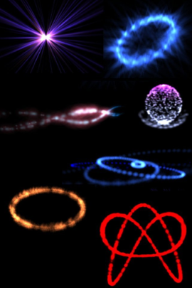 <!-- {.push-right} -->
  **Partículas** são controladas por um **emissor**
  - Ele instancia e finaliza as partículas
  - Também determina suas posições, tamanho etc.
  - Contém um ou mais parâmetros de **comportamento** das partículas, _e.g._:
    - Taxa de nascimento
    - Velocidade inicial
    - Tempo de vida da partícula etc.
- Os valores dos parâmetros das partículas são tipicamente aleatorizados

---
<!-- {"layout": "regular"} -->
## Sistemas de Partículas: Funcionamento

- Estágio de simulação (`void atualiza()`):
  - Novas partículas são criadas baseado na **taxa de nascimento**
    - Cada parâmetro inicial é definido baseado na **configuração do emissor**
  - Partículas que excederam seu tempo de vida são removidas
  - Para cada partícula viva, seus parâmetros são atualizados
    - Colisão da partícula com o mundo pode ser usado, mas não é comum (é caro)
- Estágio de renderização (`void desenha()`):
  - Partículas são tipicamente renderizadas usando uma **_sprite_ ou
    um _billboard_**
  - Mas também podemos usar `GL_POINTS`, `GL_LINES`


<!--
## Desafios

- Quando interage com objetos tridimensionais do mundo, podemos ter o (d)efeito
  indesejado de "arestas acentuadas":
  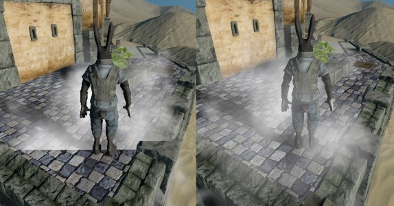
  - Vídeo mostrando [problema das arestas acentuadas](https://www.youtube.com/watch?v=ES0IY_e5Kd8)
- Para consertar, podemos usar a técnica de **_soft particles_** ao renderizar


## Desafios: usando **_soft particles_**

- A ideia é deixar a partícula transparente em suas partes próximas aos objetos
  da cena
  - É possível fazer de forma barata usando o _depth buffer_

<figure style="position: relative; width: 100%; height: 500px">
  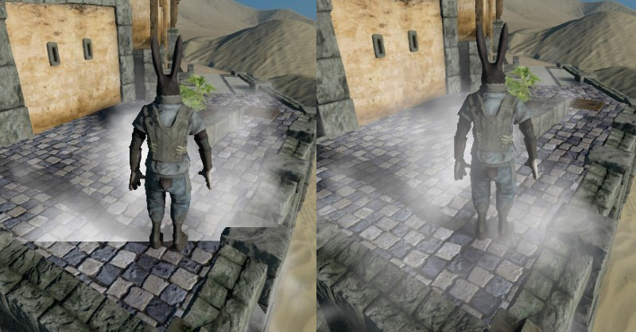
  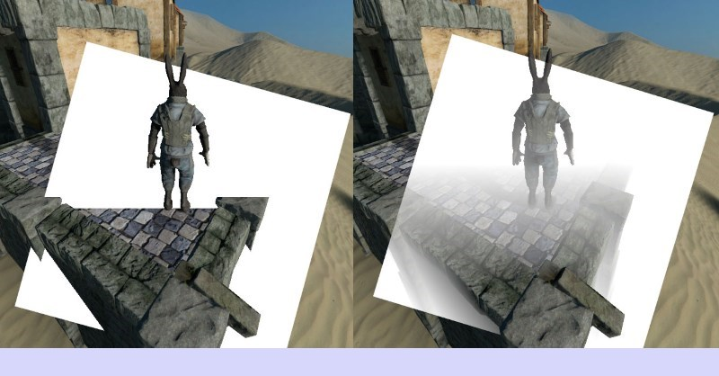
  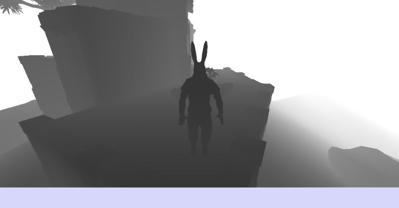
  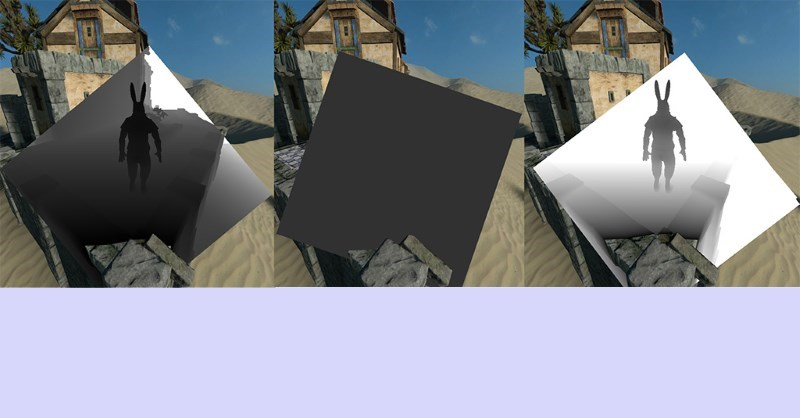
</figure>
-->

---
<!-- { "layout": "section-header", "slideClass": "environment-mapping", "slideHash": "environment-mapping" } -->
# Environment Mapping

- Simulando reflexões em tempo real
- Dois tipos:
  1. Estático: gera o mapa 1x
  1. Dinâmico: gera o mapa a cada quadro

---
::: figure .centered display: flex; align-items: stretch; height: 100%; width: 100%
<iframe src="https://threejs.org/examples/?q=cubem#webgl_materials_cubemap_balls_reflection" width="50%" height="100%" frameborder="0" style="flex: 1"></iframe>
<iframe src="https://threejs.org/examples/?q=cubem#webgl_materials_cubemap_dynamic" width="50%" height="100%" frameborder="0" style="flex: 1"></iframe>
:::

---
<!-- { "layout": "regular" } -->
# Environment Mapping: Funcionamento

- Tipo: **estático**: <!-- {ul:.layout-split-2.no-margin.bullet style="flex: 1"} --> <!-- {li:style="width: 50%"} -->
  1. Pega a imagem de textura do skybox e usa como textura `CUBEMAP` dos objetos reflexivos
  1. Custo baixo
- Tipo: **dinâmico**: ⬇️ <!-- {li:style="width: 50%"} -->
  1. Para cada objeto reflexivo, renderiza a cena 6x (cima, baixo...) e gera um `CUBEMAP`
  1. Usa a textura para o objeto reflexivo
  1. Custo bem alto

<iframe src="https://codepen.io/bartuc/full/eEbmvJ" width="100%" height="400px" frameborder="0" style="flex: 2" class="bullet"></iframe>

---
<!-- { "layout": "section-header", "slideClass": "efeitos-de-camera", "slideHash": "efeitos-de-camera" } -->
# Efeitos de câmera

- Simulando câmeras fotográficas/de filmagem
- Efeitos:
  1. Espacial: campo de profundidade
  1. Temporal: borragem de movimento
  1. _Lens flare_

---
<!-- { "layout": "regular" } -->
## Campo de profundidade (_depth of field_)

::: figure .centered
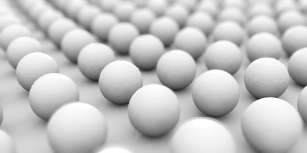 <!-- {style="height: 200px;"} -->
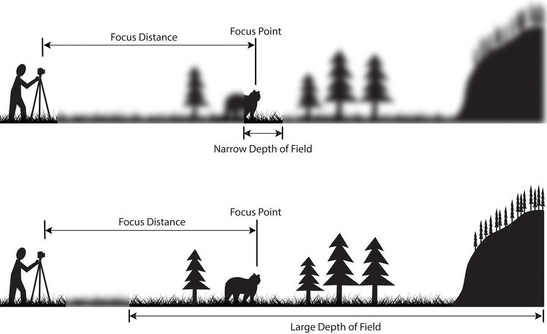 <!-- {style="height: 200px;"} -->
:::

- Simulação do fato que o olho humano mostra com menos nitidez os objetos
  que estão mais distantes do ponto alvo
- Em OpenGL, podemos usar o **_accumulation buffer_**
  - [Como fazer _depth of field_](http://www.glprogramming.com/red/chapter10.html), no livro vermelho
  - [Referência do `glAccum`](https://www.opengl.org/sdk/docs/man2/xhtml/glAccum.xml) na documentação do OpenGL

---
<!-- { "layout": "regular" } -->
# _Depth of field_ usando _Accumulation Buffer_

> _**Accumulation buffer**_ é um _buffer_ que pode armazenar dados do _Frame buffer_ por um tempo

- 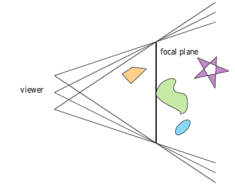 <!-- {.push-right} -->
  "Tira fotos" deslocando a câmera levemente para cada lado
- Mescla as fotos usando o _accumulation buffer_
- Regiões laterais ficam fora de foco
- Custo: desenha a cena <span class="math">n</span> vezes

---
<!-- { "layout": "regular" } -->
# Borragem de movimento (_motion blur_)

- 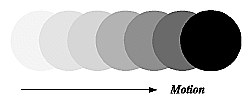 <!-- {.push-right} -->
  Simulação de efeito de movimentação muito rápida
- Também pode ser feito usando o **_accumulation buffer_**
  - [Como fazer _motion blur_](http://www.glprogramming.com/red/chapter10.html), no livro vermelho
  - Exemplo:
  ```c
  float q = 0.8f;
  glAccum(GL_MULT, q);
  glAccum(GL_ACCUM, 1-q);
  glAccum(GL_RETURN, 1.0);
  ```

---
<!-- { "layout": "centered" } -->
# Referências

- Livro _Real-Time Rendering (3<sup>rd</sup> edition)_
  - Capítulo 10: _Image-Based Effects_
- Livro vermelho
  - [Capítulo 10: _The Framebuffer_](http://www.glprogramming.com/red/chapter10.html)
- [_The Ocean Spray in Your Face_](https://www.lri.fr/~mbl/ENS/IG2/devoir2/files/docs/particles.pdf) -
  um tutorial sobre sistema de partículas simples (1998)
<!-- - [Post da Wolfire Games](http://blog.wolfire.com/2010/04/Soft-Particles)
  sobre _soft particles_ no jogo Overgrowth -->
