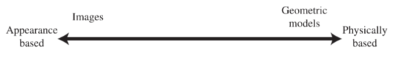
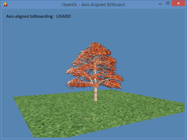
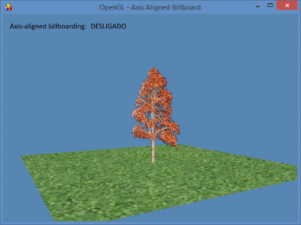

# Efeitos Visuais

---
## O espectro de renderização

_"The **goal of rendering** is to **portray an object on the screen**; how we attain
  that goal is our choice"_
  (Akenine Möller e amigos)




---
# Objetivos

1. Entender o funcionamento de **_skyboxes_** para maquear a limitação do campo de visão
1. Conhecer a técnica de **_billboarding_** e **_spriting_** para renderização "barata"
1. Simular o comportamento e aparência de gases e fogo com **sistemas de partículas**
1. Conhecer técnicas para geração de **sombras**
1. Conhecer técnicas para simulação de reflexão (espelho, metal etc.) usando **_environment mapping_**
1. Conhecer efeitos de câmera **_depth of field_** e **_motion blur_**

---
<!--
backdrop: skybox
-->

# Skybox

---
## _Skybox_

- 
  Para maquear a limitação do campo de visualização, podemos usar um _**skybox**_
  envolvendo todo o frustum
- Um _skybox_ é tipicamente criando usando um **cubo** cujas faces internas 
  recebem texturas que representam o que pode ser visto no **horizonte da cena** 
  - Mas outros modelos podem ser usados além do cubo
  - O _skybox_ **deve ser mover** juntamente com o **campo de visão**
- Por quê podemos usar um _skybox_?
  - _**Parallax**_ (ou paralaxe) é a diferença de 
  - Para objetos muito próximos do nosso campo de visão, o efeito do 
    _parallax_ é muito grande. Mas para objetos distantes, ele pode ser ignorado 

---
<!--
backdrop: billboarding
-->

# _Sprites_ e _Billboarding_

---
## _Sprites_ e _Billboarding_


- Uma **_sprite_** é uma imagem desenhada diretamente na cena
  - Pode ter os pixels desenhados diretamente, ou a partir de uma textura
    aplicada a um retângulo
  - Animações quadro a quadro podem ser feitas, utilizando mais imagens e alterando qual 
    imagem está sendo mostrada
- Um caso especial de _sprite_ é a técnica de **_billboarding_**
  - Neste caso, o polígono texturizado é **orientado de acordo 
    com a direção de visualização**
  - Quando a visualização muda, a orientação do polígono muda 

---
## _Billboarding_

- 
  A orientação pode ser definida como:
  1. _Screen-aligned_
    - Imagem sempre paralela à tela
    - <span class="math">normal = -view</span>
    - <span class="math">up = camera.up</span>
    - Útil para textos dentro da cena (e.g., etiquetas explicativas), _lens flare_
  1. _World-oriented_
    - <span class="math">normal = -view</span>
    - **<span class="math">up = world.up</span>**
    - Usado para objetos não simétricos 
  1. _Axial_
    - Rotaciona no próprio **eixo da base**
    - <span class="math">up = world.up</span>
    
---
## _**Screen**-aligned_

- Renderização de anotações explicativas
  
  <video width="484" height="380" class="left-aligned" poster="../../images/screen-aligned-billboard.jpg" controls>
    <source src="../../videos/screen-aligned-billboard.mp4" type="video/mp4" />
  </video>
  
---
## _**World**-aligned_

- Renderização de nuvens em tempo real

  

---
## _**World**-aligned_

- Trabalho de [_Harris and Lastra_, 2001](http://www.markmark.net/PDFs/RTClouds_HarrisEG2001.pdf)

  

---
## _**Axis**-aligned_




- Código fonte em [codesampler.com](http://www.codesampler.com/oglsrc/oglsrc_8.htm)

---
## Renderização de vegetação

<iframe width="640" height="360" src="https://www.youtube.com/embed/_b1QGQGh5dY?rel=0&amp;showinfo=0" frameborder="0" allowfullscreen></iframe>

---
<!--
backdrop: particles
-->

# Sistema de partículas

---
## O que é

- Um **sistema de partículas** é um conjunto de objetos pequenos colocados 
  em movimento, usando algum algoritmo
  - Os _boids_ podem ser considerados um sistema de partículas
- Com ele, é possível simular fogo, fumaça, explosões, galáxias giratórias etc.


---
# Sombras (aula do [Van-Dam](../../attachments/EfeitosVisuaisVanDam.pptx))

---
<!--
backdrop: depth-of-field
-->

# Efeitos de câmera

---
## _Depth of field_


- Simulação do fato que o olho humano mostra com menos nitidez os objetos 
  que estão mais distantes do ponto alvo 
- Em OpenGL, podemos usar o **_accumulation buffer_**
  - [Como fazer _depth of field_](http://www.glprogramming.com/red/chapter10.html), no livro vermelho
  - [Referência do `glAccum`](https://www.opengl.org/sdk/docs/man2/xhtml/glAccum.xml) na documentação do OpenGL
  
---
## _Motion blur_


- Simulação de efeito de movimentação muito rápida
- Também pode ser feito usando o **_accumulation buffer_**
  - [Como fazer _motion blur_](http://www.glprogramming.com/red/chapter10.html), no livro vermelho
  - Exemplo:
  ```c
  float q = 0.8f;
  glAccum(GL_MULT, q);
  glAccum(GL_ACCUM, 1-q);
  glAccum(GL_RETURN, 1.0);
  ```
  
---
# Referências

- Livro _Real-Time Rendering (3<sup>rd</sup> edition)_
  - Capítulo 10: _Image-Based Effects_ 
- Livro vermelho
  - [Capítulo 10: _The Framebuffer_](http://www.glprogramming.com/red/chapter10.html)
