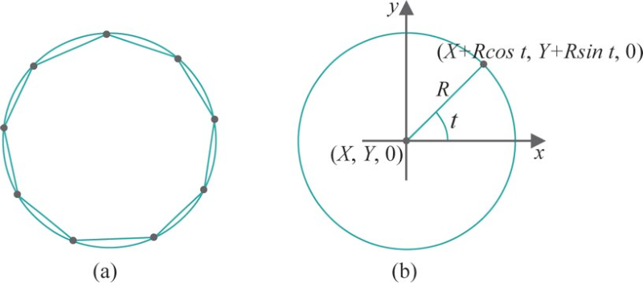

# Lista de Exercícios
## OpenGL - Primitivas

**Questão 1**: Escreva um programa em OpenGL (e.g, disco_quad.c) que desenha
no centro da janela um "disco quadrado" (um quadrado furado), como na figura
abaixo. Você deve fazer uma triangulação (não usar `GL_QUADS` etc.). Ao pressionar
 a tecla <key>`c`</key>, o modo de preenchimento deve alternar entre `GL_FILL` e
`GL_LINE` de forma que seja possível ver o polígono preenchido ou apenas suas
arestas.

**Questão 2**: Escreva um programa em OpenGL (e.g., poligono_regular.c) que
 desenha no centro da janela um polígono regular - todos os ângulos internos
iguais e todas as arestas de mesmo comprimento. O programa deve ter uma
constante "`NUM_LADOS`" que determina  quantos lados esse polígono regular deve
ter. Em outras palavras, se `NUM_LADOS=4`, o programa deve desenhar um quadrado;
se `NUM_LADOS=5`, um pentágono regular e assim por diante.

_Dica: a posição x,y dos vértices vai variar de acordo com `sin(t)`, `cos(t)`,
sendo `t` uma variável que contém ângulo e varia de 0 a 2*Pi (360 graus)._

Você deve entregar esta atividade via **Moodle**.
Valor: 3 pontos
