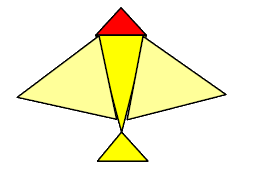

# Trabalho Prático 2 - Boids (Simulação de Bandos)

_Veja os bichos em movimento: [https://www.youtube.com/watch?v=A6nvvFkbRkY](https://www.youtube.com/watch?v=A6nvvFkbRkY)_

[Craig Reynolds](http://www.red3d.com/cwr/), como todo bom programador,
era um cara preguiçoso. Um dia, ele precisou criar a animação de vários animais
que andavam em bando e, em vez de passar dias planejando
a trajetória de cada animal, ele optou por escrever um programa que
fizesse esse trabalho por ele. Ele chamou cada animal de _boid_ e
[publicou um artigo na conferência SIGGRAPH de 1987 sobre seu
trabalho](http://www.cs.toronto.edu/~dt/siggraph97-course/cwr87/).

Inúmeros jogos e sistemas de simulação física envolvem o planejamento e
coordenação de movimento de grupos. Neste trabalho, vamos desenvolver um
programa que modela um bando de pássaros virtuais (_boids_) navegando num
espaço tridimensional.

Cada _boid_ é uma entidade independente, que possui uma posição no espaço e um
vetor velocidade associado. O movimento do bando obedece um conjunto básico
de elementos:
- **Separação**: cada _boid_ deve manter uma certa distância mínima de
  separação entre ele mesmo e os boids vizinhos (ou outros obstáculos que
  podem estar presentes no cenário)
- **Coesão**: Os _boids_ devem se manter unidos no bando. Na presença de
  obstáculos, eles até podem se separar para evitar o obstáculo, mas devem
  se reagrupar uma vez vencido o obstáculo (assumindo que esse não seja
  muito grande)
- **Alinhamento**: Os _boids_ tendem a se mover na mesma direção e com a mesma
  velocidade que os boids vizinhos

_(veja [o site de Craig Reynolds](http://www.red3d.com/cwr/boids/) e seu [artigo na SIGGRAPH'87](http://www.cs.toronto.edu/~dt/siggraph97-course/cwr87/) para mais detalhes)_

O conjunto de restrições acima definem a natureza do movimento num nível
local, mas não define o movimento coletivo do grupo. Para tanto, o
programa deverá implementar um _boid_ especial que representa o objetivo,
ou seja, o grupo, como um tudo, tende a voar na direção desse _boid_-objetivo.
Tanto os _boids_ quanto o _boid_-objetivo devem ser inicializados com valores
razoáveis, e o vetor velocidade do _boid_-objetivo deve ser controlado pelo
usuário através de comandos do teclado (ou do mouse). Lembre-se de
ajustar a direção e o módulo do vetor velocidade de cada _boid_, de forma
a manter o grupo.

Esse trabalho deve ser individual, e como funcionalidade básica, valendo
80% da nota, deve ter os seguintes itens:

1. Deve haver um mundo razoavelmente grande definido, com um “chão” que pode
   ser modelado por um plano horizontal. No centro desse mundo deve haver uma
   torre em forma de cone
1. Devem haver pelo menos 3 modos de visualização distinos: o primeiro com o
   olho posicionado no alto da torre no centro do mundo, o segudo atrás
   do bando, à uma distância fixa, e o terceiro perpendicular ao vetor que
   representa a velocidade do bando, e paralelo ao plano do chão. Em todos
   os três modos, a direção de visualização é partindo do olho para o centro
   do bando (ponto médio das posições de cada boid) com a normal apontando
   perpendicular ao plano do chão
1. O mundo deve ser iluminado, podendo usar o modelo padrão do OpenGL
1. Cada _boid_ deve ser desenhado como um poliedro tridimensional. Pode ser algo
   simples, como 5 pirâmides:

   
1. O número de _boids_ deve poder variar de acordo com comandos do usuário, por
   exemplo, pressionando a tecla “+” deve criar um novo _boid_ próximo ao bando
   e a tecla “-” elimina um _boid_ aleatoriamente do bando

Para se obter o restante dos pontos do trabalho (ou até mesmo mais pontos
extras) funcionalidades adicionais podem/devem ser implementadas no jogo. Essas
funcionalidades serão avaliadas conforme a dificuldade da implementação, o
efeito obtido com ela no jogo, e a qualidade da implementação. Exemplos de
funcionalidades extras com suas respectivas pontuações:

1. **Obstáculos (10%)**: além do chão e da torre de visualização, outros
   objetos podem ser acrescentados à cena (sugestões sendo esferas e cones,
   cujos algoritmos de interseção com raios estão dadas nas notas de aula
   do Prof. David Mount) e os _boids_ devem evitar colisões com esses
   obstáculos, inclusive violando os outros fatores determinantes do
   comportamento do grupo. O _boid_-objetivo é um fantasma, e passa através
   dos obstáculos
1. **Animação (7%)**: Os _boids_ devem ter movimentos animados correspondente
   ao batido das asas. Isso pode ser implementado acrescentando um estado a
   cada _boid_, que corresponde à posição da asa. Cada _boid_ tem o seu estado
   independente dos demais
1. **Modelo (7-10%)**: em vez de desenhar os _boids_ usando poliedros
   tridimensionais, você pode criar um modelo usando um _software_ de modelagem
   (e.g., blender, 3dstudio, Maya) e usá-lo no seu programa
1. **Música (5%)**: você pode incluir ambientação sonora para seu simulador
1. **Temática (5%)**: você pode usar outra temática para seus _boids_ que não
   passarinhos. Por exemplo, pode ser um cardume de peixes, esquadrão de
   aviões anti-alienígenas ou rebanho de ovelhas. Basta que saibam voar
1. **Sombras (5%)**: Não é necessário projetar sombra de um _boid_ no outro,
   mas apenas uma projeção paralela simples dos _boids_ no chão. Modelos mais
   sofisticados podem ter mais pontos extras
1. **Fog (5%)**: funcionalidade acrescentada por comando do teclado, podendo
   ser habilitada e desabilitada durante a execução
1. **Modo de pausa (3%)**: acionado pelo teclado para a simulação dos _bois_,
   congelando a imagem (_boids_ podem ser acrescentados e retirados durante
   a pausa)
1. **Reshape (5%)**: permitir o redimensionamento da janela de visualização
1. **Banking (10%)**: um objeto no espaço está sujeito a rotações em 3 eixos
   básicos. Assumindo a base ortonormal onde X aponta para frente (em
  relação ao objeto), Z para cima (em relação ao mundo) e Y é o produto
  vetorial de X e Z (para o lado), a rotação em torno de Y é chamada _pitch_ e
  faz o objeto apontar pra cima quando sobe e pra baixo quando desce. A
  rotação em torno de Z se chama _yaw_ e faz o objeto apontar pra direção
  (lateral) em que voa. A rotação em X, se chama _row_, e o ato de executar
  essa rotação se chama _banking_. O ângulo de _row_ está relacionado com a
  taxa da curva (derivada segunda da trajetória). O cálculo de um ângulo de
  _row_ suave pode ser complicado, portanto preste atenção
1. **Qualquer outra idéia (??%)** que torne a simulação mais interessante ou
   agradável aos sentidos. Essas idéias precisam ser documentadas e explicadas
   no documento de entrega do trabalho (README)

O valor máximo almejado é de 150% da nota do trabalho. Deve ser entregue um
arquivo .tar.gz ou .zip via Moodle contendo:
  1. Todo o programa fonte, com os _Makefiles_ e bibliotecas necessárias
     para a compilação do programa
  1. O arquivo executável
  1. Um **arquivo README** com uma descrição da sua implementação, e as
     **instruções para a compilação e a execução** do seu jogo
  1. 3-5 _screenshots_ do seu simulador
  1. [opcional, +3%] O link para um vídeo (youtube, vimeo, dailymotion etc.) do
     seu simulador mostrando as opções implementadas

Qualquer dúvida, entre em contato comigo. Ou acrescente a sua interpretação no
arquivo README e mãos a obra.
