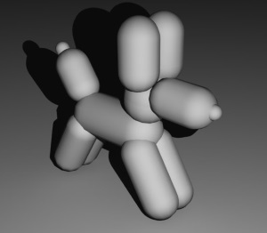

# Trabalho Prático 4 - Animação

Neste trabalho, você e outro colega criarão uma animação tridimensional
simples.

A dupla deve usar um programa de modelagem e animação em 3D como o blender, 3ds
Max ou Maya e criar uma pequena animação de 20 a 30 segundos.

Os modelos e a animação não precisam ser profissionais. Você pode usar um
conjunto de primitivas do programa como esferas, cilindros, pirâmides, cubos e
formar objetos compostos (à la _boid_ de 5 pirâmides). Por exemplo, um cachorro
feito de "cápsulas":

Sua cena deve conter:

1. Um personagem principal (não precisa ser um "ser vivo")
1. Pelo menos uma fonte de luz
1. Pelo menos uma textura em um objeto (no chão, por exemplo)
1. Um cenário com um pouco de detalhamento
  - Por exemplo, se for um cenário de escritório, além das 4 paredes, chão e
    teto, deve ter uma mesa, armário, porta, janela
1. Animações simples dos objetos, mas de uma forma "verossímel"
  - Se for um cachorro andando, ele deve parecer que está andando =)

A implementação dos itens citados equivale a 80% da pontuação do trabalho. Os
20% restantes (e mais uns pontinhos extras) podem ser conseguidos com
funcionalidades adicionais, descritas abaixo:

1. **(10%):** uso de sons e trilha sonora
1. **(5%):** uso de uma textura para _bump mapping_ ou _displacement mapping_
1. **(5-15%):** uso de modelos mais complexos
1. **(4%):** uso de fontes de luz _spot light_
1. **(12%):** uso de texturas em todos os objetos (aplicáveis)
1. **(10%):** animação via _rigging_ (uso de "ossos")
1. **(10%):** um ou mais sistemas de partículas para criar fumaça, vapor, fogo
   ou outros fenômenos naturais
1. **(5-10%):** animação da câmera
  - Câmera em movimento (5%)
  - Alternância entre câmeras diferentes (5%)
1. **(5%):** a cada 5s adicionais da animação acima de 30s. Só não vale
   fingir que é o Stanley Kubrick no filme 2001: Uma Odisséia no Espaço
1. **(??%):** outros adicionais propostos por você

A entrega será dividida em 3 partes:

1. Divisão do grupo (04/12/15 - quinta-feira)
1. Roteiro + mini [_storyboard_](http://pt.wikipedia.org/wiki/Storyboard) (09/12/14 - terça-feira)
1. Animação final: um vídeo no Youtube (20/01/15 - terça-feira)

**Entrega (1):** o grupo é de 2 pessoas. Posso abrir exceção para grupos de 3,
porém os itens do escopo inicial do trabalho passam a valer 60% em vez de 80%.
Você deve listar seu grupo no Moodle, usando o link de submissão do trabalho.

**Entrega (2):** não espero nada muito formal nesta entrega. Apenas uma
sequência de quadros (uns 4-6 quadros) com os acontecimentos da sua animação
e um parágrafo explicando o roteiro. Também deve ser entregue via Moodle.

**Entrega (3):** você deve gerar um vídeo usando a própria ferramenta de
modelagem e fazer _upload_ para o Youtube. O link da sua animação deve ser
postado no Moodle.

Dia 22/01/15 (quinta-feira) teremos uma apresentação dos trabalhos regada a
**pizza e refrigerante**. Tragam suas barrigas com fome \o/
