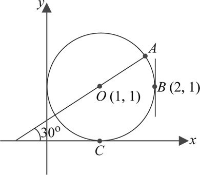

# Lista de Exercícios
## Geometria Analítica e Álgebra Linear

Utilize as seguintes aproximações, se precisar:
- sin 30° = cos 60° = 0.5
- sin 45° = cos 45° = 0.707
- sin 60° = cos 30° = 0.866
- π = 3.141, ✓2 = 1.414

As primeiras 7 questões referem-se à figura abaixo.

**Questão 1**: Qual é a equação deste círculo?

**Questão 2**: Quais são as coordenadas do ponto C?

**Questão 3**: Qual é a equação da tangente ao círculo em B?

**Questão 4**: Qual é o comprimento do arco menor do círculo entre A e B?

**Questão 5**: Quais são as coordenadas do ponto A?

**Questão 6**: Se o círculo for movido de tal forma que seu centro fique em
  (-3, -4), onde o ponto B ficaria?

**Questão 7**: Suponha que um outro círculo seja desenhado com seu centro em A
  e passando por O. Os dois círculos se intersectam em dois pontos. Qual o
  ângulo que suas tangentes fazem nesses pontos?

**Questão 8**: Se uma linha reta em um plano passa pelos pontos (3, 1) e (5, 2),
  por quais, se algum, dos seguintes dois pontos a reta também passa por cima:
  (9, 4) e (12, 6)?

**Questão 9**: Quais são as coordenadas do ponto médio do seguimento de linha
  reta que junta os pontos (3, 5) e (4, 7)?

**Questão 10**: Em que ponto as linhas retas 3x + 4y − 6 = 0
e 4x + 7y − 8 = 0 se intersectam?
